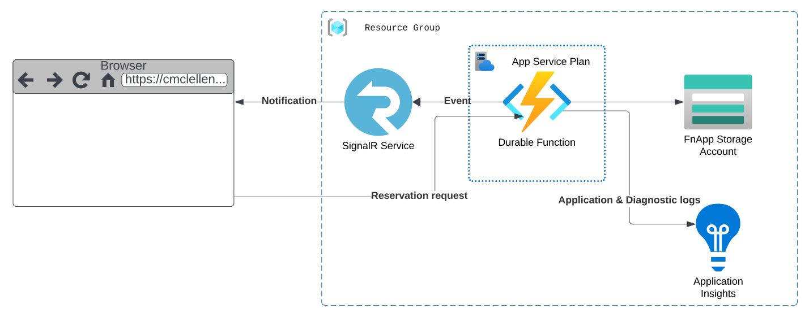
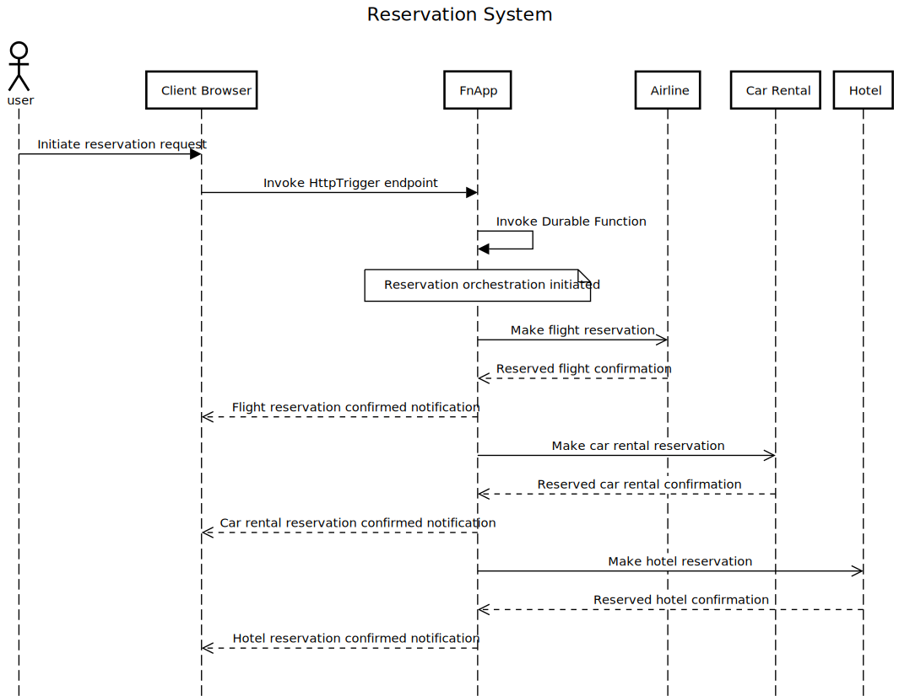

# Reservation System

### Overview
This is a reservation system designed to take the hassle out of reserving flights, rental cars and hotels. The process is initiated by a click of a button on the web page, after which the system orchestrates the reservation of a flight, car rental and hotel for the user.

The UI is a React SPA that interfaces with an Azure Function App. The user initiates a reservation via a button click on the UI, which calls through to an Http triggered Azure Function. This function then initates the orchestration by calling a Durable Function. All events throughout the orchestration are reported back to the UI via an Azure SignalR service that the Durable Function interacts with. The user has the option to simulate a failure at any one of the reservation steps, which would then demonstrate compensating actions cancelling any prior reservations, ensuring the reservation is not left in an inconsistent state.

### Architecture Diagram

### Sequence Diagram
